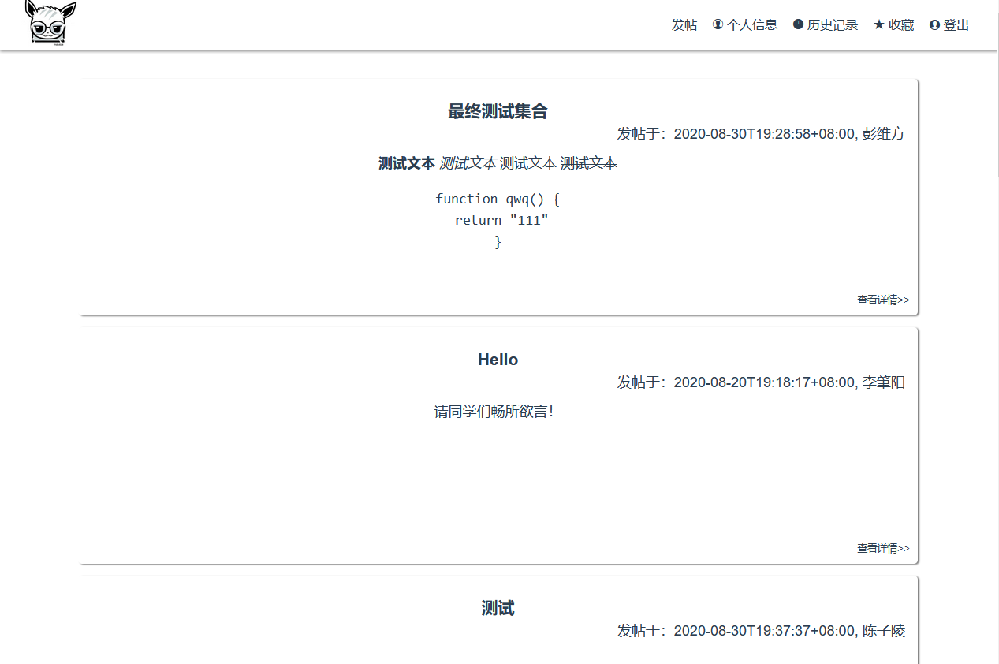
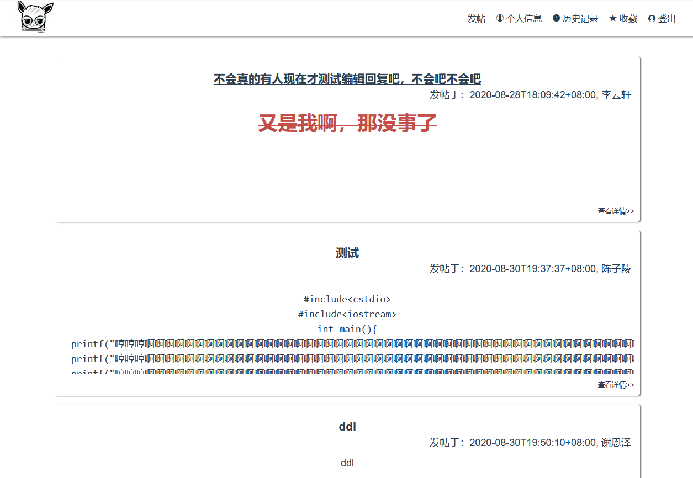
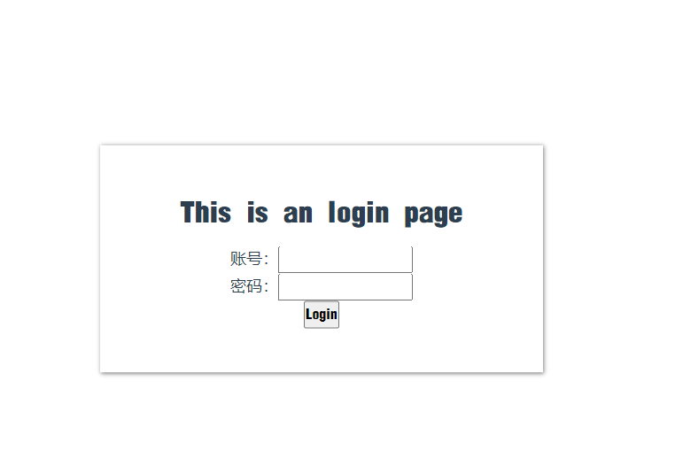
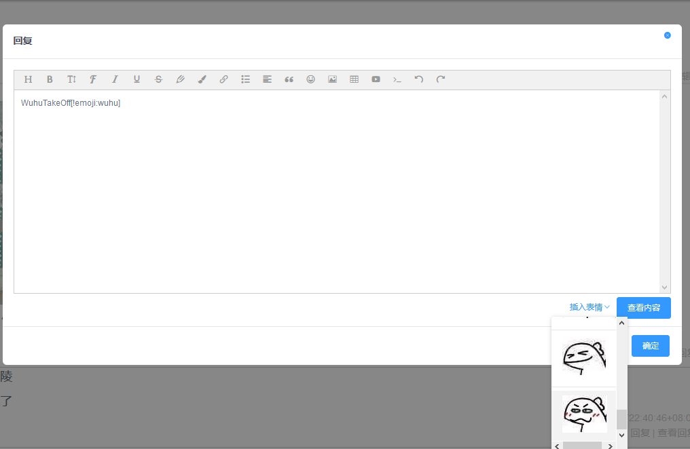
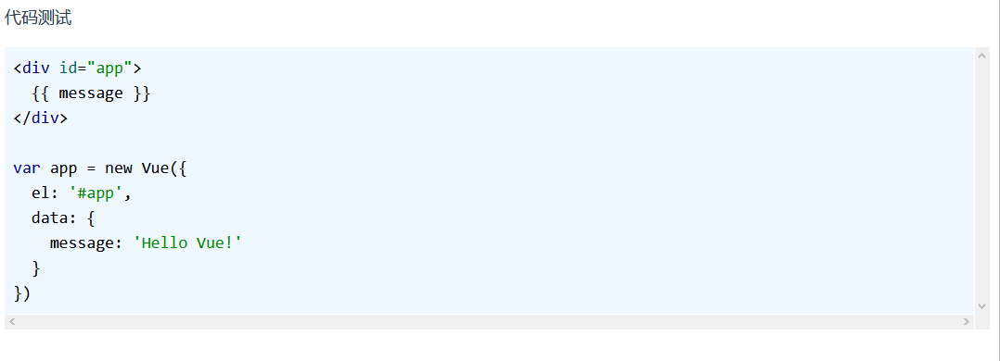
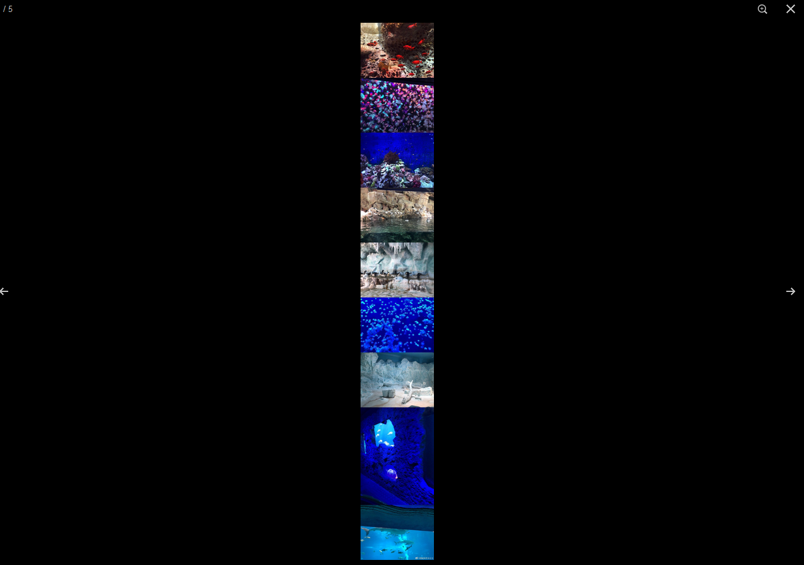
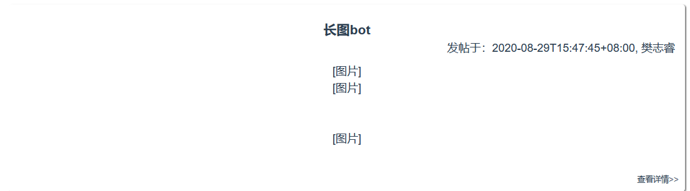

## 《清软论坛》——前端大作业完成报告

### 1. 实验环境

* 操作系统：windows 10 64位；
* 浏览器：Chrome  （版本: 85.0.4183.83，64位）、Firefox（版本：80.0，64位）
* IDE：vscode
* 框架：`vue-cli`
* 插件：`type-script`、`vue-router`、`iview`、`wangeditor`、`vuex`、`vue-property-decoration`、`vue-photo-preview`、`axios`

### 2. 启动编译方式

`npm install`

`npm run serve`

### 3. 功能实现情况

* 基本页面
  * 主页：
  * 帖子页面 
  * 登录页面：

功能实现：

* 基础功能
  * 使用 `vue` 搭建了网页框架
  * 使用 `axios` 与提供的后端进行交互，能够处理返回的错误信息
  * 使用了 `router` 进行页面间的跳转
  * 设置了登录页面，通过将账号和密码传递给后端以获取 `token`，账号密码错误是会返回密码错误，正确时会将用户的信息存储在本地，并通过 `router` 将页面跳转至主页
  * 在主页中展示用户发的帖子，可以展示其标题、发帖人、发帖时间以及帖子内容等信息，设置了帖子列表的分页
  * 可以通过导航栏中的发帖进行主动发帖，在帖子详情中可以通过点击回复对主帖或者下面的回复进行回复，对于自己发的帖子或者回复，可以通过点击编辑进行再编辑
  * 可以在主页或者帖子页面通过点击某人的名字去看某人发布的帖子，也可以通过导航栏中的`个人信息`来仅展示自己的发帖
  * 对于帖子和回复实现了展示富文本内容以及自定义格式

* 进阶功能
  * 在帖子详情中处理了前端分页
  * 实现了在bbs中显示对主帖的回复和对跟帖的回复（楼中楼），并对楼中楼进行了分页
  * 通过自定义标签插入了自定义表情，将表情相关的图片放在了网络中云端服务器 
    * 根据图床的网络状况，可能读取不到表情的图片，如出现状况，本地代码没问题，只需重新传一下图床的图就可
  * 实现了代码展示功能 
  * 实现了外部图片的链接以及长图的展示 
  * 对帖子中的图片实现了统一的查看和跳转 
  * 对于帖子内容含有富文本的情况，将图片处理成立 `[图片]`的格式方便展示
  * 实现了只看楼主、收藏、浏览记录等功能并在其中处理了分页（退出登录后失效）
    * 浏览记录按照浏览的最新顺序排序

### 4. 展示链接

`post/796`

`post/788`

`post/760`

`post/777`

